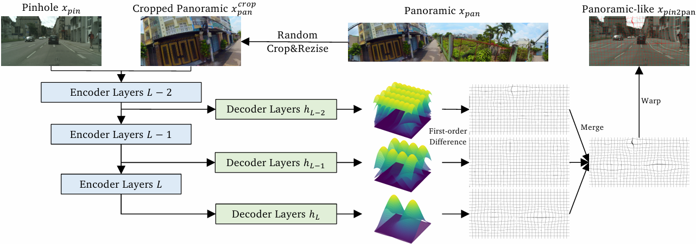

# Gaussian Constrained Diffeomorphic Deformation Network for Panoramic Semantic Segmentation

> **Gaussian Constrained Diffeomorphic Deformation Network for Panoramic Semantic Segmentation**<br>
> ICASSP 2025<br>

<!-- [YouTube](https://www.youtube.com/watch?v=c55rRO-Aqac&ab_channel=JaeminNa)<br> -->

> **Abstract:** *Panoramic semantic segmentation has garnered increasing attention due to its ability to provide comprehensive environmental perception. However, it requires a large number of annotated panoramic images to achieve satisfactory performance, which is costly. Recently, Domain Adaptation for Panoramic Semantic Segmentation (DA4PASS) has been proposed to reduce the reliance on annotated data by transferring segmentation models trained on annotated pinhole images to unlabelled panoramic images. Previous DA4PASS methods mainly focus on aligning features between pinhole and panoramic images, overlooking the unique appearance characteristics of panoramic images, particularly object distortion. To address the appearance discrepancies between pinhole and panoramic images, we propose Gaussian Constrained Diffeomorphic Deformation Network (GCDDN), which applies a panoramic deformation transformation obtained by Gaussian kernels to the annotated pinhole images. Specifically, GCDDN predicts multiple Gaussian kernels and performs first-order horizontal/vertical differences to obtain a naturally smooth and reversible panoramic deformation field, which is diffeomorphic. Due to its universality, GCDDN can be integrated into any domain adaptation (DA) method. Extensive experimental results demonstrate that integrating GCDDN leads to substantial improvements in both DA methods for pinhole images and those specifically designed for panoramic images, with a maximum gain of 1.80\% in outdoor scenarios. Our source code will be made publicly available.*

## Table of Contents

- [Introduction](#Introduction)
- [Requirements](#Requirements)
- [Getting Started](#getting-started)
- [Citation](#Citation)

## Introduction



Overview of GCDDN. GCDDN generates deformation fields through multi-level Gaussian kernels to perform panoramic deformation on the pinhole images $x_{pin}$, reducing the inherent appearance differences between it and the panoramic images $x_{pan}$.

## Requirements

- Linux
- Python
- PyTorch
- CUDA (must be a version supported by the pytorch version)
- run `pip install -e .` at `GCDDN` directory

## Getting Started

### preparation

Following [Trans4PASS](https://github.com/jamycheung/Trans4PASS) to prepare datasets. 
Following [Trans4PASS](https://github.com/jamycheung/Trans4PASS) to prepare pretrained SegFormer, and put it into

```
pretrained/
└── mit_b2.pth
```

### [Optional] pretrain with source domains

Download official checkpoint from [Trans4PASS](https://drive.google.com/drive/folders/12lI9EPo8FD2kjhw-M6nLaaEoxHmByvIS) or train it yourself:

Please change the corresponding path in [segmentron/data/dataloader/cityscapes.py](segmentron/data/dataloader/cityscapes.py) and [segmentron/data/dataloader/densepass.py](segmentron/data/dataloader/densepass.py)

```bash
bash remote_pretrain.sh tools/pretrain_single_outdoor_norm.py configs/cityscapes/trans4pass_plus_small_512x512_norm.yaml "0,1,2,3"
```

### domain adaptation

Please change the corresponding path in [adaptations/gs_source_only.py](adaptations/gs_source_only.py)

For domain adaptation, we only provide source settings, and other DA methods can also be implemented similarly.

```bash
cd adaptations
CUDA_VISIBLE_DEVICES=0 python gs_source_only.py --snapshot-dir=try --morph-type=GaussianMorph
```

The results are saved at [adaptations/snapshots/](adaptations/snapshots/)

### test

```bash
CUDA_VISIBLE_DEVICES=0 python adaptations/evaluate_outdoor.py --restore-from /home/jjiang/experiments/GCDDN/official_ckpt/trans4pass_plus_small_512x512.pth
```

## Citation

If you find GCDDN useful in your research, please consider citing:

```bibtex
TODO
```
